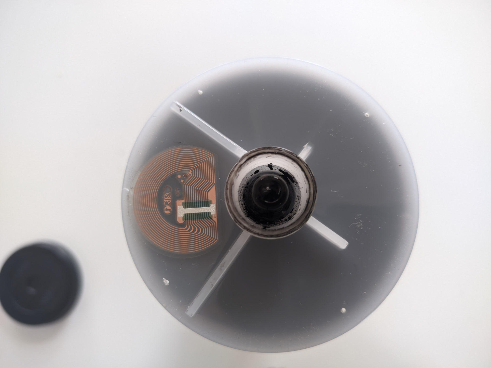

<!--[title|Hijacking a RISO printer ink cartridge]-->
<!--[description|And getting double the ink]-->
<!--[author|Lena]-->
<!--[timestamp|1751618618]-->
<!--[image|hijacking-a-riso-printer-ink-cartridge/banner.jpg]-->
<!--[image-alt|A half-empty RISO ink cartridge on a table]-->
<!--[tag|fun]-->
<!--[tag|hardware]-->
<!--[tag|printer]-->
<!--[tag|nfc]-->

This is a bit of a short one, but this trick made me super happy, so i thought it might have been useful to someone else too.

At a social space i frequent, we have an old RISO printer (EZ200e) that can print *very* fast. (i think they're called digital duplicators?)

It's quite old, but since it still works flawlessly, there's no reason to replace it.

I generally **really** hate printers: they're clunky, slow, and always seem to fail in obscure ways the exact moment you need to print something.

This one is generally pretty tame though, all its issues are pretty easily fixable.

Until now.

## the problem

A few months ago, the printer started to report 'no ink', when ink cartridges got half full.

This was quite odd, but not knowing a fix, instead of throwing them away, we just started stockpiling half-full cartridges in hopes it'd miracolously fix itself and start accepting the perfectly-good cartridges.

If you're reading this blog post though, that obviously didn't happen, so we had to find another solution.

How does the printer even know how much ink is left? after all, given that ink is liquid, there must be *something*, some kind of sensor, right?

As it turns out, there actually isn't a sensor, but just a NFC chip on each cartridge (as you can see in the picture below), where the printer stores information, such as *how much ink it has pulled out of the cartridge until now*.

As you can probably guess, if we can fool the printer into thinking that a cartridge is full when it's not, it will just pull all the remaining ink out of the cartridge.

That's the theory, at least. Doing it in practice wasn't as simple as cloning a Mifare Classic NFC card, where all the tooling is already made.

## NfcV shenanigans

After reading the NFC tag with my phone using various apps, it turns out to be a `NXP ICODE SLIX2`, an ISO 15693 compatible (`NfcV`) tag, with 80 4-byte blocks (for a total of 320 bytes).

But when you tried reading the contents, no app other than [Metrodroid](https://www.metrodroid.org/metrodroid/) seemed to be able to read it, let alone do anything else with it.

This was a big problem, because without the ability to clone the tag of a full cartridge onto a half-full cartridge, the whole plan can't be done.

Looking further though, Android [does support ISO 15693 (NfcV) tags](https://developer.android.com/reference/android/nfc/tech/NfcV), so there must have been a way to do it.

Worst case, i'd have had to create my own app, which would have been very time consuming, without even knowing if this procedure even worked in practice.

Then, i found out that [NFC Tools](https://www.wakdev.com/en/apps/nfc-tools-android.html), can send custom NFC commands to a tag, provided you know what you're doing.

Whatever you do though, do **NOT** type on a search engine `"ISO 15693" filetype:pdf`

## Doing The Thing

After dumping with Metrodroid a full cartridge and a half-empty cartridge to JSON files, diffing them and doing a few trips of [jq](https://jqlang.org/) (thanks [@sela](https://social.nihil.gay/sela) <3), we finally got a list of all blocks to write to the tag.

One at a time, of course!

The command is `Write single block`, and is (hex) `02 21 XX YY YY YY YY`, where `XX` is the block index to write, and `YY` is the 4-byte block to write.

The first few blocks aren't writable, as is expected of any NFC tag, but writing all the writable blocks is enough to make the cartridge work.

## what happens when the cartridge runs out of ink?

I don't know. Probably just printing a few blank pages thinking there's still ink left, or maybe not. When that eventually happens, i'm going to post an update here.

I'll likely make an app at some point. Or maybe not.