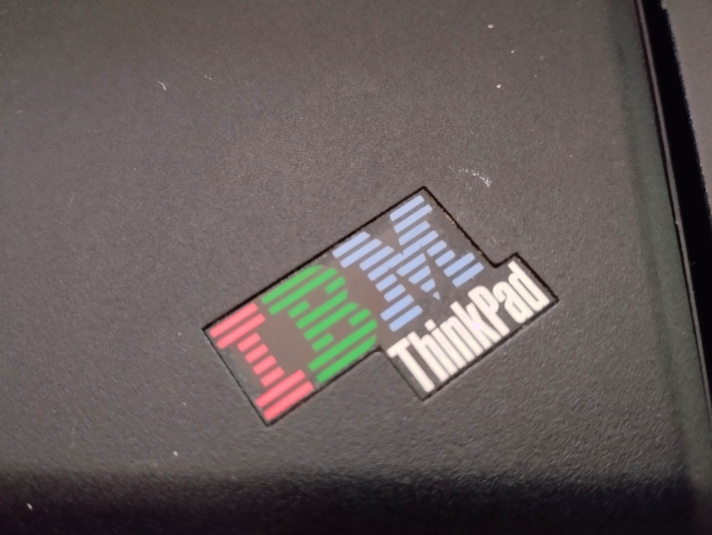
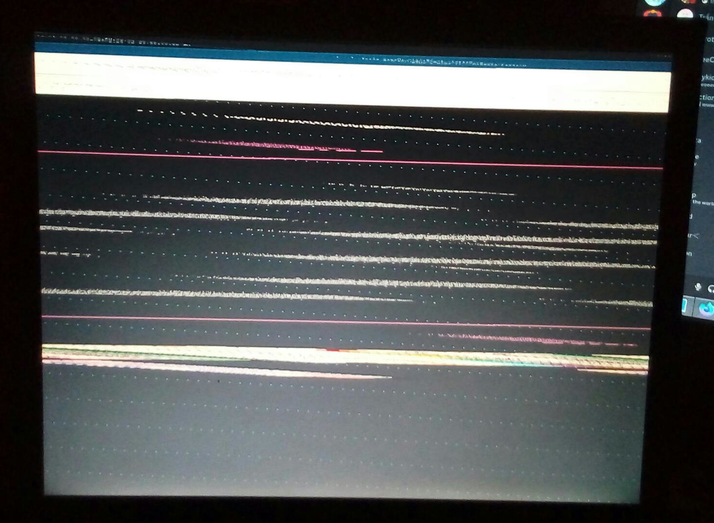
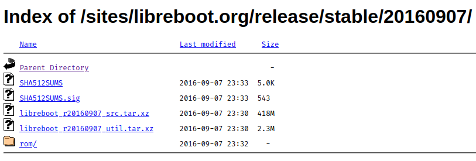

<!--[title|Installing coreboot on a ThinkPad T60p]-->
<!--[description|...and a "review" of Hackers (1995)]-->
<!--[author|Lena]-->
<!--[author|Sela]-->
<!--[timestamp|1708868625]-->
<!--[image|installing-coreboot-on-a-thinkpad-t60p/bios.jpg]-->
<!--[image-alt|The IBM BIOS logo]-->
<!--[tag|ThinkPad]-->
<!--[tag|coreboot]-->
<!--[tag|linux]-->

I recently bought an used Twinkpad T60p for very cheap (10€) at a local market, and my partner [sela](https://social.nihil.gay/sela) (who wrote 90% of this) immediately wanted to put [coreboot](https://coreboot.org/) on it.

This cute little shell holds a Core 2 Duo (x86-only sadly), ATI graphics, 4GiB of DDR2 RAM and lots of other nice peripherals, like IR, a modem and an Intel 1000e Ethernet controller.

<!---->

The shell is almost identical to my T61 (i wonder why :3), but this one has the IBM logo on the body and the back of the display, but also the Lenovo logo below the actual screen.


## Installing linux

Before installing coreboot, i had to get a useful system up and running first.

Being a 32bit machine, i couldn't install [Arch Linux](https://archlinux.org) on it, but i knew there was a project that provided 32bit support for it.

So i went over to [Arch Linux 32](https://archlinux32.org) to grab an ISO, and...

> Current Release: 2023.03.02

That's almost a year old!

As expected, while installing, i had PGP signature errors. They were quite annoying, as i couldn't even install the new `archlinux32-keyring` package.

After manually importing all the necessary PGP keys, it all went relatively smoothly.

Installed all the necessary userspace tools, and started up `sway`.

## Graphical issues

Just having started `sway`, the display output got all mangled and illegible.

A quick `swaymsg -t get_outputs` reveals that the 1024x768 display has listed 1400x1050 as a valid display option.

(this is what my blog looked like in firefox)



That was a quick fix though, and forcing the display to run at its native resolution mostly solves the issue.

# Coreboot, or, the part you were interested in

## Preface

Before we begin, I'd like to clarify the notation we will be using. Commands that work as any regular user
shall be denoted with a line beginning with a `$`, example:

```
$ echo "Hello, world!"
```

Any command that needs to be ran as the superuser (i.e. `root`) shall be denoted with a line starting with `#`:

```
# echo "Hello, world!"
```

Additionally, this entire procedure will be an *internal flashing* procedure. This means we're flashing the new
firmware directly from the device that will be running the firmware, so it must be already functioning and 
running some sort of OS (preferably Linux, or some BSD). This is distinguished from *external flashing*,
where you'd need a flasher that you solder on to the pins of your device, and another device with which
to write using the flasher. As such, no additional hardware is required (that is, if you don't fuck up and
brick your device, in which case the way to recover it is using an external flasher)

If you want to actually follow this procedure, please read through the whole post first! There will be many
contradictory steps, because this is mostly a document of our experiences, additionally containing what
actually worked for us, so please be careful! We may make a blog post which is much more barebones, containing
just the necessary instructions to get it running without documenting all of our problems.

NOTE: As of writing (26-02-2024) there was [a new release of libreboot](https://libreboot.org/news/libreboot20240225.html)
(25-02-2024) which contains them switching away from `flashrom` in favor of `flashprog`, so this blog post 
is already out of date! That's awesome!

## So what is coreboot, anyways?

[coreboot](https://coreboot.org) is a project that seeks to create an open-source extensible firmware (i.e. BIOS/UEFI) for use in
embedded devices, primarily; the project, though, also supports many older laptops, and among those, the majority of laptops that
*had not* been designed with coreboot in mind are ThinkPads, which was always intriguing to me. I had always wanted to tinker with it.

This laptop was the first opportunity I had to actually attempt something of the sort: keep in mind that if I messed this up, we could
result with a completely bricked system, which would require an external flasher to fix (if we don't forget to back up the original
BIOS, anyways)

coreboot, though, has many distributions of it (not too dissimilar to how Linux distributions work): coreboot on its own is quite barebones,
support for various platforms exists but is not curated so thoroughly. These distributions tend to simplify the process, containing
pre-tested, already working configuration files for various systems. Among them is [libreboot](https://libreboot.org), one of the more
commonly used distributions with a focus on freedom and it being libre: that is, free of binary blobs and proprietary software.

While this is something I love personally, this does end up biting us in the ass slightly for our particular hardware.

## Peculiarities of our laptop

You may not have realized, but throughout this blog we have referred to our laptop as specifically the T60p, a variant of the T60.
This variant, in particular, features an ATI GPU, instead of the usual Intel iGPUs found in other models.

This renders our work more difficult, as there are no open-source or reverse-engineered drivers (at least to our knowledge) for
the ATI GPU our laptop features. As we will later find out, what we need to do is dump the binary blob from our running computer
for us to then load with coreboot to guarantee our video output working correctly, as otherwise we'd end up having a headless laptop,
[something covered by libreboot](https://libreboot.org/docs/install/#flashrom_lenovobios) ([archive](https://archive.is/453O0#flashrom_lenovobios)):

> ThinkPad T60 with ATI GPU: flash the Headless T60 ROM (no video init, but you can get a serial console on the RS232 port if you 
> use the Advanced Dock or Advanced Mini Dock. Connect to it from another machine, using null modem cable and USB serial adapter;
> Screen can connect to the serial console and you will run it at 115200 baud rate. agetty/fgetty in Linux can give you a serial
> console in your OS)

In summary, we need to mix and match and craft our own coreboot binary. There are no easy ways out of this.

## The steps to take

Interestingly, instructions were plentiful, between libreboot having official support for a variant of our laptop, an official guide on
the [coreboot wiki](https://www.coreboot.org/Board:lenovo/x60/Installation), some blog posts, libreboot having the T60/X60 documented
and some GitHub repository containing [a coreboot build specifically for the T60p](https://github.com/BASLQC/t60p_coreboot_src)
(spoiler: we did not use it), with a link to a [nice wiki](https://github.com/bibanon/Coreboot-ThinkPads/wiki/ThinkPad-T60p)
explaining all the steps, which was seemingly the most up to date source.

The main issue with all of these was that they tended to indicate different steps to be taken, some working, others not; sometimes missing
required context; being generally out of date; pointing at invalid URLs or just generally not guiding you enough in what you need to do.
Where possible, we followed the last source as it seemed to be the best.

## Extracting the VGABIOS
To get our video output working, as described previously due to [the peculiarities of our laptop](#peculiarities-of-our-laptop) we needed
to extract the VGABIOS from our running computer. On top of that, the VGABIOS is unique to each and every laptop and patched at boot,
as such we couldn't simply utilize someone else's VGABIOS (there is an alternative method, extracting from a BIOS backup, covered
[here](https://github.com/bibanon/Coreboot-ThinkPads/wiki/T60p-Extract-VGABIOS-From-Backup). You should follow the steps in 
[our following section](#backing-up-the-original-bios-or-where-the-issues-began) to extract the BIOS, though).

The following snippet is accredited in the wiki to Peter Stuge:

```
# cat /proc/iomem | grep 'Video ROM' | (read m; m=${m/ :*}; s=${m/-*}; e=${m/*-}; \
  dd if=/dev/mem of=vgabios.bin bs=1c skip=$[0x$s] count=$[$[0x$e]-$[0x$s]+1])
```

This left us with a file called `vgabios.bin` containing the binary. We then needed to find the device ID for our GPU as it is unique to
each and every device, and getting it wrong would leave us with a broken video output (or, rather, no video output at all).

To this end, we used `romheaders` from the FCode suite. As the laptop was running Arch, we tried looking for it on the official packages
but it was unavailable; it did, however, exist on the AUR. We had no AUR helper on the laptop (and also `makepkg -si` kept complaining
that the various packages didn't support `pentium4`, when `i686` would suffice, but regardless) and we didn't want to waste any time
trying to compile it on that brick, so we moved the VGABIOS onto a more powerful desktop from which we compiled the FCode suite and
analyzed the binary:

```
$ romheaders vgabios.bin
```

This left us with a long output of various information. The only thing we were interested in was the "PCI Data Structure", specifically
the vendor ID and device ID:

```
Vendor ID: 0x1002
Device ID: 0x7145
```

These values would then need to be embedded into our coreboot binary, so we had to write them down.

## Backing up the original BIOS, or, where the issues began
Continuing to follow the instructions on the wiki page (which redirected us onto the instructions for the T60, on a specific section),
the first instruction was to navigate into a directory called `libreboot_bin/`.

Which directory? I had no idea either. We hadn't downloaded anything so far, as there was no request from the instructions anywhere
to do so.

Scrolling up revealed that what we needed were the so-called "libreboot binaries". The wiki page helpfully pointed us to
[this link](http://libreboot.org/download/) which was, to say the least, extremely confusing considering the fact there was *no*
indication of any sort of binaries. The only talk of binaries was at the end of the page, which mentioned statically-linked
executables. These were very much out of date, so we thought it couldn't be those.

We thought we needed to maybe compile them ourselves, so we looked around for a long time for the source of the various tools.
We eventually found some of the utilities that were cited in that page, `flashrom` and `bucts`. We found the source for `bucts`,
installed flashrom (`flashrom` was actually in `extra`!), so we tried them out and... well, we then realized the actual commands
we were supposed to run utilized different utilities (`flashrom_lenovobios_sst` and `flashrom_lenovobios_macronix`) and we had
*no* idea where to find those. We tried with `flashrom` but that simply didn't work.

At this point, we felt quite defeated, unsure of what to do at all, and as such we decided to distract ourselves with the best
thing we had on hand (or, rather, lena decided she wanted to finally watch something together as we had never really had the
opportunity to do so), that being [Hackers (1995)](https://www.imdb.com/title/tt0113243). Keep in mind we kept watching it
during practically the whole process, usually going back to it whenever we felt defeated, pausing it and coming back to 
whatever we were doing before we had carried on with watching the movie.

We went onto the http mirror, trying to figure out what was going. We thought that, maybe, the instructions wanted us to download
the source, which then contained these tools within, so we did so (and, wow, libreboot's source is *huge*). To nobody's surprise
(except ours) there were no such binaries. We looked around the various directories to no avail.

We then tried downloading the ROM for our laptop under the `roms/` directory within each release. We downloaded one, and, well,
it was simply a few binary files, most likely the pre-compiled ROMs.

So we did what anyone else would do, and started searching on the web for anything we can find on these so-called "libreboot binaries".
From there we found multiple sources beyond the wiki page we were following (even a Wikibooks page!) but all of them talking about the
exact same "libreboot binaries", pointing us to different links (one even to the installation page rather than the download page).
Needless to say, we were lost and confused, unsure on what to do at all.

...

We ended up going back and reading through what the libreboot installation page had to say about the T60/X60 process.
What we found was.. intriguing:

> NOTE: This section partially relates to `utils` release archive in Libreboot 20160907, which contains static compiled binaries 
> for things like bucts and flashprog. It will still work on modern distros, and thus is still referenced here. The `flash` script
> in that release can be used, with modern Libreboot ROMs. Current Libreboot releases do not include pre-compiled utilities,
> only ROMs.

and...

> You can just get bucts from the libreboot project, same thing for the patched flashprog. In the Libreboot 20160907 release,
> there is a utility archive, which has statically compiled executables. They still work just fine on modern systems, 
> and they can be used for this purpose.

So we went and looked around on the HTTP mirror once again, and...



Could this be it? 

We downloaded and extracted the archive on the laptop and..

```
lena@lena-t60p ~/libreboot_r20160907_util> ls -l
total 56
drwx------ 4 lena lena 4096 Sep  2  2016 bucts/
drwx------ 5 lena lena 4096 Sep  2  2016 cbfstool/
-rw------- 1 lena lena 5979 Sep  7  2016 ChangeLog
-rwx------ 1 lena lena 4280 Sep  2  2016 flash*
drwx------ 5 lena lena 4096 Sep  2  2016 flashrom/
drwx------ 5 lena lena 4096 Sep  2  2016 ich9deblob/
-rw------- 1 lena lena 5979 Sep  7  2016 NEWS
drwx------ 4 lena lena 4096 Sep  2  2016 nvramtool/
-rwx------ 1 lena lena 1686 Sep  2  2016 powertop.trisquel7*
-rw------- 1 lena lena   10 Sep  7  2016 version
-rw------- 1 lena lena   11 Sep  7  2016 versiondate
```

Jackpot! Exactly what we needed!

So we navigated into the `flashrom/i686` directory and had all the binaries that the wiki was citing (i.e. `flashrom_lenovobios_sst`
and `flashrom_lenovobios_macronix`), and as such we proceeded with the instructions to back up the BIOS.

```
# ./flashrom_lenovobios_sst -p internal -r factory.bin
# ./flashrom_lenovobios_macronix -p internal -r factory.bin
```

Although, neither of these worked. Both gave us the same error, related to being unable to access `/dev/mem`. We were quite puzzled,
but after looking through the libreboot installation page, at the top it talked about flash errors, and among them about ours.
The way to fix our issue was to set the `iomem=relaxed` kernel parameter. 

Afterwards, the `sst` binary didn't work, but the `macronix` one did in our case. This is due to the fact there's some variation
between revisions (from what I gathered) and as such there's 2 different binaries with different patches to access the chip
containing the firmware. At least one should work, if not, refer to the libreboot installation page, at the top, in the "flash errors".
If that doesn't solve it, try asking on IRC about it, someone is bound to be able to help.

We were left with a binary file containing our original BIOS, and we transferred it onto the desktop available to us for
safe keeping, in case we very badly messed up.

## Building coreboot

The next step in our journey was to actually build our own coreboot release, configured for our laptop, containing the
necessary VGABIOS and all the other options we were interested in. As such, we followed the procedure outlined in the
wiki page we originally started with, as it seemed the most complete.

First step was installing the dependencies for building coreboot. We recommend, instead of following exactly what the
wiki says, to follow what the official coreboot documentation specifies. As such, the dependencies for various distros
can be found [here](https://doc.coreboot.org/tutorial/part1.html#download-configure-and-build-coreboot).
Follow the first three steps outlined in that document (i.e. downloading dependencies, the source and building the
necessary toolchain for your platform, in this case i386).

Next step is in configuring our build. For this, we will base ourselves on the configuration provided by libreboot
in each release. The latest release (when we did our experimentation) was 2024-01-26, as such we grabbed the sources
for it [from one of the mirrors](https://libreboot.org/download.html) and extracted them.

The guide then tells us to navigate to `libreboot_src/resources/libreboot/config/t60`, which doesn't exist! Gah,
what is it with guides and being out of date?

We were able to sucessfully find the directory, under the path `libreboot-20240126_src/config/coreboot/t60_intelgpu`
(there is also another directory, called `t60_16mb_intelgpu/`, seemingly for a 16MB variant of the flash chip)
and this was the file layout within:

```
.
├── config
│   ├── libgfxinit_corebootfb
│   └── libgfxinit_txtmode
└── target.cfg
```

The guide then tells us that what we're interested is in the `config` file. Huh? Which config?

We looked at the contents of `target.cfg` but those seemed unrelated to the actual configuration needed for coreboot,
as such we ignored it. Looking at the two other configuration files, they seemed to be what we needed, but we were
unsure which one exactly we needed as there was no clear description of what either did, as such we simply picked
the one that seemed the most reasonable (the `corebootfb` variant) and copied it to the root of our coreboot source
directory, under the name `.config`. We later found out there is a distinction between the two, as described on the
[libreboot page found here](https://libreboot.org/docs/install/#init-types-and-display-mode) (and, spoiler, this may
or may not be related to a small issue we had further down the road)

Continuing to follow the guide, we edited the `.config` file, finding the "Payload" section and replacing it with
the following:

```
#
# Payload
#
CONFIG_PAYLOAD_SEABIOS=y
CONFIG_SEABIOS_STABLE=y
CONFIG_PAYLOAD_FILE="payloads/external/SeaBIOS/seabios/out/bios.bin.elf"
CONFIG_COMPRESSED_PAYLOAD_LZMA=y
```

This, though, should be done **only if you want to run SeaBIOS**. If you want to keep libreboot's GRUB configuration
instead, follow [this guide](https://github.com/bibanon/Coreboot-ThinkPads/wiki/T60p-Build-Coreboot-with-GRUB2)
from the wiki we were following. Keep in mind we **have not tested it** and thus cannot guarantee any of its information
being up to date, complete or even correct. Hopefully we've shown you the more common pitfalls so far .

Now, on to visually configurating coreboot:

```
$ make menuconfig
```

First of all, make sure that "Devices" -> "Run VGA Option ROMs" is **disabled**. SeaBIOS loads these on its own.

Next step is in including the actual VGABIOS binary in our coreboot build. The wiki page tells us that this is
located under a specific "VGABIOS" menu, which seemingly does not exist anymore. As such, we had to hunt for
the options it talks about, and found them elsewhere:

Set "Devices" -> "Add a VGA BIOS image" to **enabled**; "VGA BIOS path and filename" to "**vgabios.bin**" and
set the "VGA device PCI IDs" to `(vendor_id,device_id)`, replacing these with the ones you recovered from
your dumped VGABIOS [in the first few sections!](#extracting-the-vgabios), so it should look something like:
`(1002,71c4)`.

Next up, actually build the coreboot binary (you can still add `CPUS=$(nproc)` or something of the sort): 

```
$ make
```

Final step is to patch your `coreboot.rom` (in `build/`) using the following commands:

```
$ dd if=coreboot.rom of=top64k.bin bs=1 skip=$[$(stat -c %s coreboot.rom) - 0x10000] count=64k
$ dd if=coreboot.rom bs=1 skip=$[$(stat -c %s coreboot.rom) - 0x20000] count=64k | hexdump
$ dd if=top64k.bin of=coreboot.rom bs=1 seek=$[$(stat -c %s coreboot.rom) - 0x20000] count=64k conv=notrunc
```

Congratulations! You've build your first coreboot binary.

## Flashing the binary (the scariest part)

If all has gone well so far, you shouldn't have any issues; but beware, there's still a chance to brick
your device. So please take care, make sure you've backed up any and all data you care about, or have a
way to read it even if your device does get bricked.

Continuing to follow the instructions on the wiki page, it seems to refer to some sort of utility called
`lenovobios_firstflash`. We couldn't find it among the libreboot binaries we had downloaded and couldn't
locate them anywhere, as such we consulted the [libreboot installation page](https://libreboot.org/docs/install/#flashrom_lenovobios)
([archive](https://archive.is/453O0#flashrom_lenovobios))
on how to continue. Please follow that as there's no use in copying the same information over, as what is
written in this blog post may become outdated! Note: **run these commands on the laptop you're trying to
coreboot, not another device!**

If all of the steps indicated there go well, then congratulations! You've got coreboot running on your
ThinkPad T60p!

## Additional steps

While this is a functional config, there were some issues with it: the main one being, GRUB not
displaying its graphical menu after being chosen from SeaBIOS.

After having consulted on IRC, the issue turns out to be that we needed "Display" ->
"Graphics initialization" was set to "**Use native graphics init**" when it needed to be 
set to "**None**", so you should do that.

An additional issue that may happen pertains to networking. After flashing the new firmware,
this may result in your network interfaces changing names. This can result in your network config
no longer working, leaving you puzzled why networking doesn't work. It's not a coreboot issue:
simply modify your config appropriately to suit the new interface names.

If you ever need to flash a newer release of coreboot (after having already replaced the original
firmware!) you don't need to go through this whole guide: you can simply build without patching,
as to flashing all you need to do is to use `# flashrom -p internal -w path/to/new_coreboot.rom`.

## Conclusion

This was a long and scary process. It took a lot of effort, a lot of perseverence and frustration to
complete, not least because of all the information being scattered in many places, incomplete or
outdated. Regardless, this was a very, very fun project.

As for the movie, it was one of the worst movies I've ever watched. And yet, I thoroughly loved every
second of it, due to how cheesy and pretentious it is. The graphics were fun, the quotes are fun - 
"mess with the best, die like the rest"; "snoop on to them as they snoop on to us" - and it was
generally a great watch. If you've never seen it, you should! You'll hate it for how badly represented
hacking (or, in general, any computer) is, but you'll definitely enjoy it.

