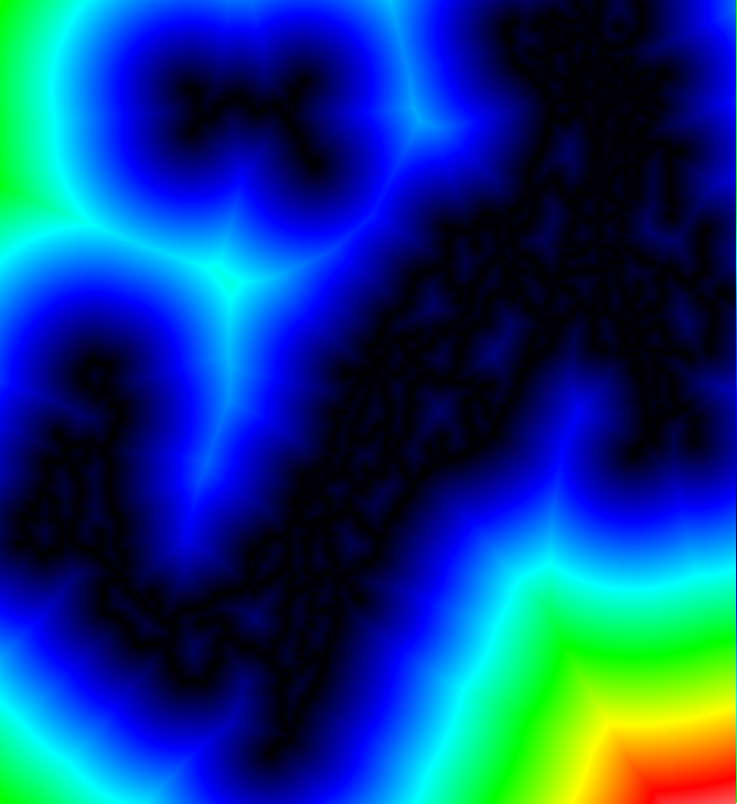
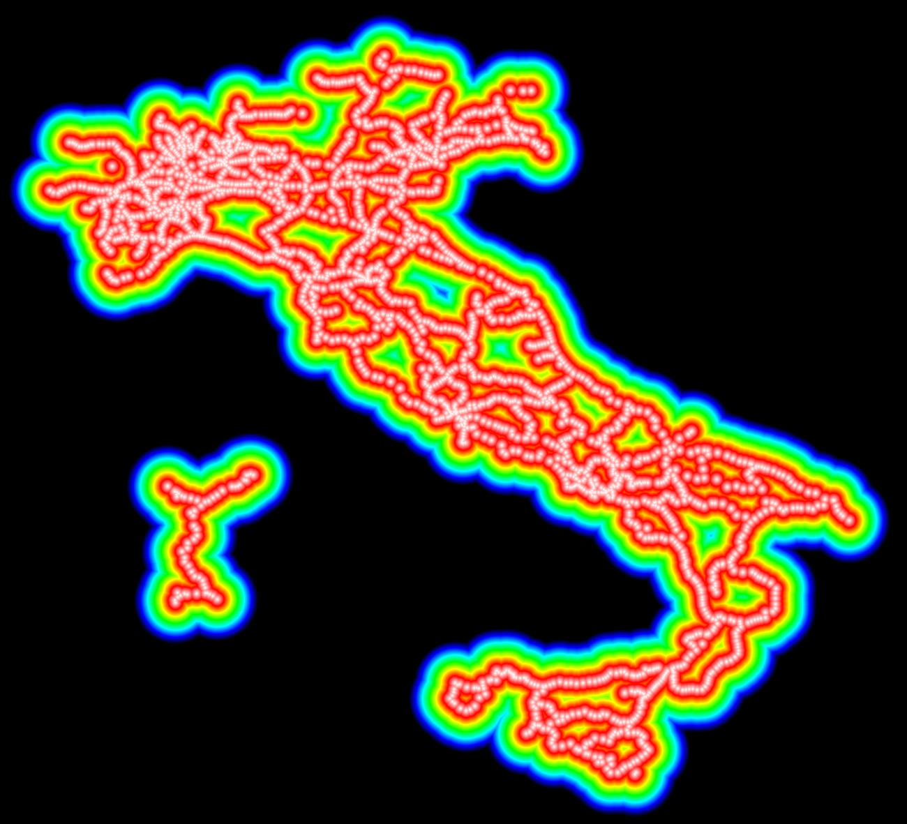

<!--[title|Making a railway coverage heatmap - Part 1]-->
<!--[description|This was harder than expected]-->
<!--[author|Lena]-->
<!--[timestamp|1701703796]-->
<!--[tag|trains]-->
<!--[tag|railways]-->
<!--[tag|statistics]-->
<!--[tag|rust]-->

<div class="content-warning">Content Warning: contains very colorful/"psychedelic" images</div>

Ever since i created my [fast-heatmap](https://crates.io/crates/fast-heatmap) crate (highly vectorized heatmap generator), i've been trying to find new ways of representing existing data in a cool and visually pleasing way.

I frequently go look at [OpenRailwayMap](https://www.openrailwaymap.org), as it contains pretty up-to-date information on railway coverage, speeds, signaling and more, and a few weeks ago i had the idea of generating a world heatmap of railway coverage, to more easily see the distance between train stations.

## Gathering the data
At first, i wanted to just clone the OpenRailwayMap dataset, but after a bit of looking, i didn't really manage to grab it easily, and i wanted to get started quickly, as i had lots of motivation in that very moment.

I had already initiated a project involving railways (not public yet), which is still ongoing, and it involved scraping railway APIs for various station data.

Of this data, i already had the names and coordinates of all the italian railway stations (2592), and i could begin a proof of concept with that data.

I already knew this project would be compute intensive, so i started a new rust project to get started.

## The idea

Since i needed to output an image, i had to have a grid of points, each with a distance value from the nearest station. I could then use that value per each point to generate a heatmap.

I imported the [geo](https://crates.io/crates/geo) and [image](https://crates.io/crates/image) crates, and got to work.

I began by creating a `Vec<Point>`, to store all the points on the grid, picked a starting coordinate and generated points each with a **0.0001°** difference.

If you're familiar with coordinates and geographical mapping you should already be able to see an issue with that approach, but i continued on.

So i did a quick `cargo run`... and a few seconds later my PC started stuttering. I quickly pressed CTRL-C to try figuring out what's wrong.

## The first hurdle

The obvious culprit is the `Vec<Point>`. After a quick calculation, i was trying to generate around ***1251999000*** points, which at 16 bytes per point (2 `f64`, latitude and longitude) amounts to around ***18.6GiB*** of RAM. That's a problem.

This meant i could not store my data points, and they had to be generated and streamed on the fly. Sounds like a perfect job for an [Iterator](https://doc.rust-lang.org/std/iter/trait.Iterator.html)

Say hello to `RectGridIterator`! This will generate a sequence of equally distanced* points inside a rectangle.

The code was very ugly, but it worked nonetheless. I decreased the resolution for a quick test and...

Success???



Something's clearly not right...

Changing a single line seemed to fix the scale.

```rust
let value = fast_heatmap::get_color(pre_val);
```
All was needed was a simple subtraction.

```rust
let value = fast_heatmap::get_color(u16::MAX - pre_val);
```

This was very slow though, and i wanted to increase the scale. I clearly needed to improve on it.

## Making it faster

There were many options to make the process faster, but the lowest hanging fruit was to utilize my whole CPU with [rayon](https://crates.io/crates/rayon).

After quickly implementing it by cloning the iterator (around 30 bytes each, not the best), it did get faster, but a flamegraph showed that there was still a lot to be desired.

Turns out i had to completely redo my point generation algorithm to make it not suck, to eliminate all the clones.

After a bit of thinking, i managed to use the same algorithm, but generating any point at any time, without the need for a sequential order.

It sped up a LOT, even more than i predicted it would, as this cost wasn't really that visible on the flamegraph.

With this, it was time to generate a good, high resolution image. After tweaking a bit with the parameters, i got this result (scaled down, the final image is 62MiB)



This took about 25min to generate at full resolution, which at around 1km point-to-point, wasn't too bad for a first good result.

## The end?

I tried overlaying a geographical map on top of it, but i ran into some clear issues with this approach, that i hinted at earlier.

Using a constant angle does ***not*** mean a constant distance between the grid points, as this decreases the closer you are to the poles. Furthermore, i had been using the [Haversine distance](https://en.wikipedia.org/wiki/Haversine_formula) formula, and to generate that image, it was ran around ***397 billion times***. With a quick estimate, doing the whole world map this way would mean doing this calculation around ***400 quadrillion*** (400,000,000,000,000,000) times.

That's definitely way too much and we need a better method.

In part 2, i'll try moving from a simple array to a [R* tree](https://en.wikipedia.org/wiki/R*-tree), and switching from degrees to [LAEA](https://en.wikipedia.org/wiki/Lambert_azimuthal_equal-area_projection) (constant-distance projection, in meters).

For now, you can find all the code [here](https://github.com/adryzz/railway-heatmap).

That's it for today. After all this math i'll work with something a bit more practical (hint: networking), so expect something in the coming weeks!