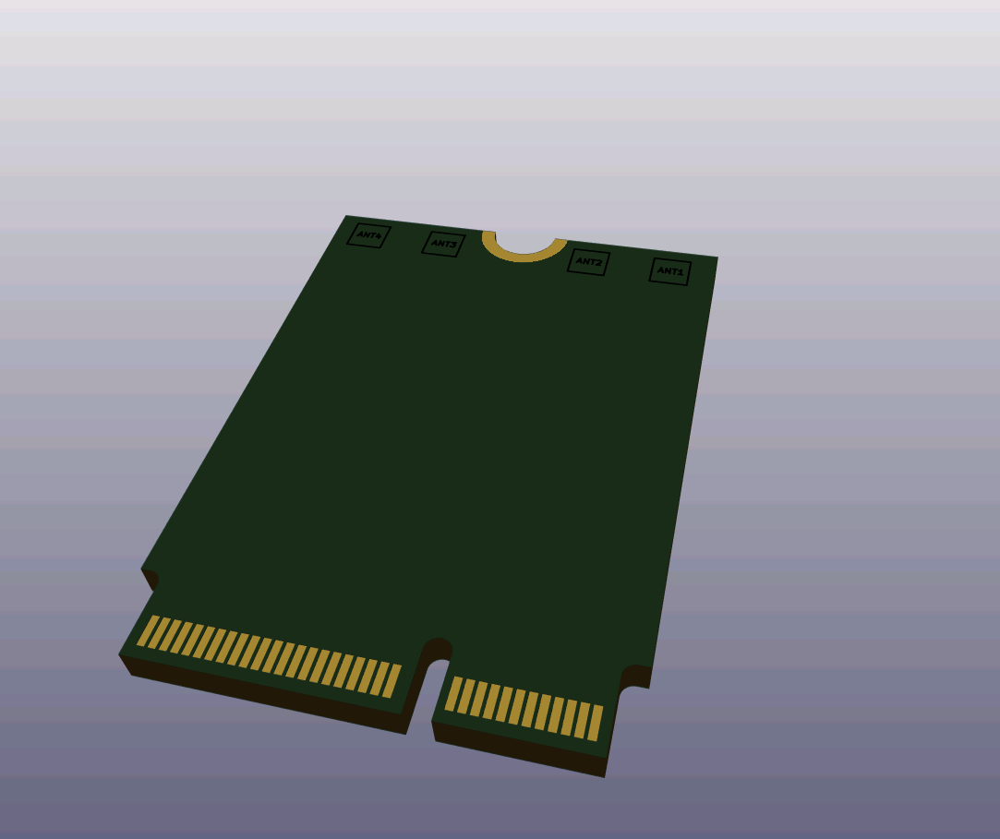

<!--[title|Status update - May 2025]-->
<!--[description|lots of hardware design, not a lot of hardware]-->
<!--[author|Lena]-->
<!--[timestamp|1746201389]-->
<!--[tag|status]-->
<!--[tag|hardware]-->
<!--[tag|software]-->
<!--[tag|PCIe]-->
<!--[tag|M.2]-->
<!--[tag|OpenBikeComputer]-->

Hi all!

In the [last status update](/blog/a-status-update-what-ive-been-working-on), i was mainly working on OpenBikeComputer.

There's been lots of new developments on that front, in that the first hardware design i'm somewhat proud of is almost done. That's great, but now i've arrived at the real problem: while i've designed the hardware to be as cheap as possible without making any compromises, i (sadly) at the moment do not have the cash flow to be able to pull the trigger and order the boards and all the components.

That's a big problem, because without the hardware i cannot develop any of the software that makes it all work. Yay! another unfinished project!

## In the meantime

In the meantime though, i've started working on something else (and almost finihed it), which stems from another pet peeve of mine.

Lots of makers design some really good USB-based projects, and while they're really cool, often times i'd like to have such a project embedded into my laptop, and not as a clunky USB device sticking out.

The solution is to turn such USB projects into PCIe M.2 projects, and it's surprisingly easy to do.

The easiest M.2 footprint to target is the `Key E`, which offers access to lots of peripherals, such as USB, I2C, SDIO, and lots more.

Looking around though, it doesn't look like many people are aware of how easy it is to design such a board.

What's worse is that in the KiCad library, there's a symbol for M.2 connectors, but not any footprint, and thus you'd have to [read 200 pages long specification](https://web.archive.org/web/20200613074028/http://read.pudn.com/downloads794/doc/project/3133918/PCIe_M.2_Electromechanical_Spec_Rev1.0_Final_11012013_RS_Clean.pdf) and design the footprint accordingly.

Or, from now, you can just head to [this repository](https://github.com/adryzz/M.2-kicad-lib), and get OSHW licensed, handmade M.2 footprints, featuring antenna placements, and all spec compliant.

## Other stuff

Arch Linux and other distros will soon be deploying [drm_panic](https://patchwork.kernel.org/comment/25638725/) with QR codes, to make it easier to report kernel panics to the dev team. That's great, but given that the kernel log is encoded and compressed, that makes it annoying to read a kernel log without a network connection.

As you probably would have guessed, i made [an android app](https://github.com/adryzz/drm_panic-viewer) to help with just that.

It'll soon be released on F-Droid and other repositories, when it'll stop being buggy.

I've also probably done other stuff, but i don't remember, so it's probably not as important.
