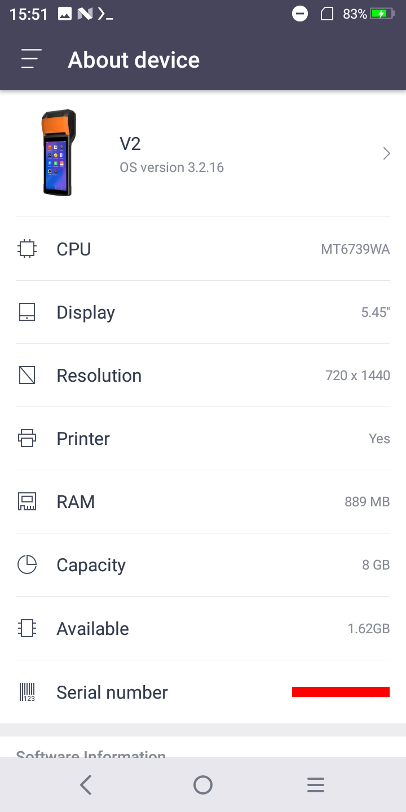
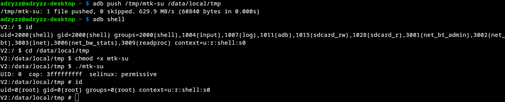
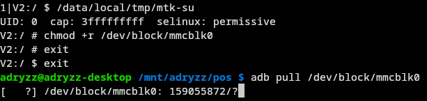
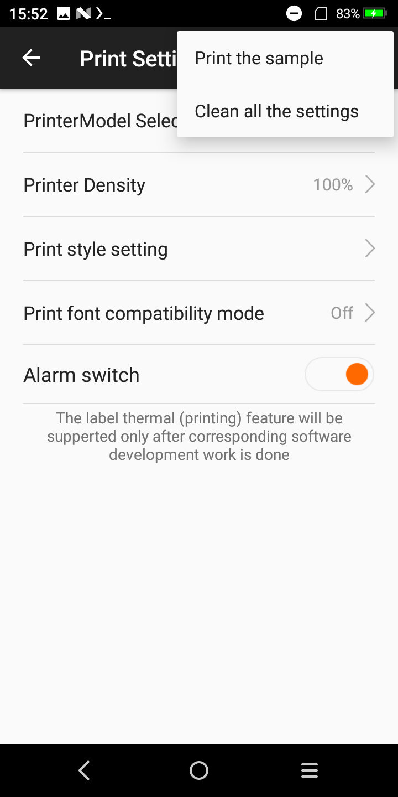
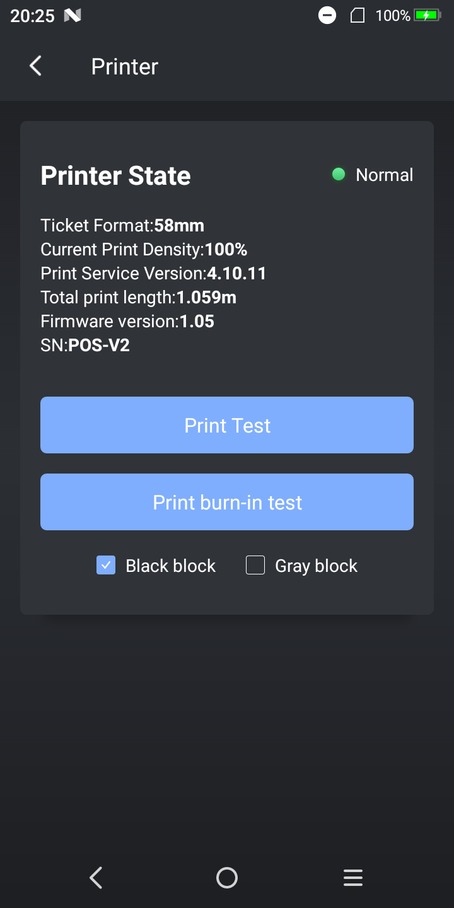
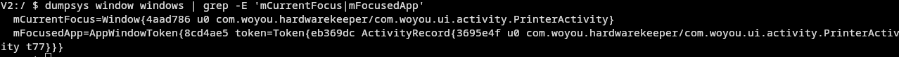

<!--[title|SUNMI V2 reverse engineering]-->
<!--[description|Poking at a cool device i found]-->
<!--[author|Lena]-->
<!--[timestamp|1701425969]-->
<!--[tag|Android]-->
<!--[tag|reverse-engineering]-->
<!--[tag|CVE-2020-0069]-->

> *Most of this post was written over a month ago, keep reading to see why*

I was at a garage sale the other day, and i spotted what i thought to be an old android phone from a distance, but that later turned out to be a [SUNMI V2](https://www.sunmi.com/en-US/v2/), and i wanted to have a bit of a challenge and try to get root access on it and see how it all works under the hood.
The guy was asking 10€ for it, saying that "it does charge", but i managed to get it for 7€.

My primary goal was: getting something to print on the inner printer.

To do that without needing to interface with some proprietary weird API, i had to get root on this thing.

## Getting root access on the device

After turning it on, i expected it to load some kind of proprietary page asking me to log in but, to my surprise, it booted straight to the launcher.

(the apps were installed by me later on)

So, i headed straight to the settings, into the "About device" section, to see if they somehow disabled the developer options.

Turns out this is Android 7.1.1 Nougat running on kernel 4.4.22, and the SoC is a MT6739WA from MediaTek (armv7l).

As soon as i saw an old MediaTek, i knew what i needed to try: CVE-2020-0069, also known as mtk-su.

In order to try and exploit the vulnerability, i had to get code execution on this thing, and i had two options: either an APK file, or via adb.

I went into the now-enabled "Developer options" menu, and i found both an USB debugging toggle and a non-standard Wireless debugging one, indicating that ADB is, in fact fully enabled.

With this, i tried wireless debugging, and... this annoying window pops up.

They apparently want you to login in order to debug one of these. It turns out they have enrolled a custom ADB key as well.

Discouraged, i tried USB debugging and... it just worked. Didn't even ask me to trust my PC's RSA key.

That's weird.

First thing i did was `ls /dev`, but unsurprisingly, this thing is pretty locked down. Or is it?

(CVE-2020-0069 in action)

That was quite unexpected, and meant i now had full access to this device.

## Finding the printer device

I was now able to run `ls /dev`, but nothing pointed directly to a thermal printer.

There were a lot of `tty` devices, with the most interesting ones being `ttyMT0`, `ttyMT1`, and a raw SPI device, `spidev0.0`.

Writing data to any of these devices didn't produce any output, so i knew i had to go deeper.

The device tree probably had what i needed, but when running `ls /proc/device-tree/`, the results were even more confusing.

I found two different devices with `printer` in the name: `gpio_printer` and `spi_printer`.

Now, before messing something up, i wanted to do a full ROM dump on my PC, just to have something to restore in case something goes very bad.

### Dumping the ROM

The device of course doesn't have enough space to store a dump of its own ROM (8GiB), and does not have any expandable storage slots.

Because of this, i came up with the stupidest idea i've had in quite a while:

I honestly didn't think this would work, but it apparently did. (and quite quickly too, 22MiB/s)

## Finding the process running the printing service

Since looking for the printer in the devicetree turned unconclusive, i had to trace the full call graph, or at least the way i thought it'd look like (app wants to print -> connects to print daemon -> daemon writes to printer device)

After looking around in the settings, there is a menu that allows you to print some sample text with the builtin printer:

This meant, that if i were to find the process that is doing the printing, i could `strace` it to find out what device it's writing to, and make my own custom driver for it.

For this though, i needed to prove that there is an actual printing service, and the apps weren't just writing to a device.

During this search, i looked around the preinstalled apps, and found this menu:

It says `Print Service Version: 4.10.11`. Exactly what i was looking for!

This also was an app i could `strace` to find the print service binary.

I only needed to find the package name of the app, which was fairly easy to do:

I now had to find the PID of `com.woyou.hardwarekeeper`, to `strace` it and see how it's communicating to the printing service.

It turns out it's communicating using [standard android service binding](https://developer.android.com/guide/components/bound-services) to `woyou.aidlservice.jiuiv5`.

You guessed it, it was time to `strace` that one as well!

But for some reason, after running `strace` on that process, the results were underwhelming, as there were no meaningful `write` calls.

I was missing an important piece of the puzzle.

## Looking for traces online

So i went to google, as ***google knows everything***. Until now i hadn't searched on the internet anything about this device at all.

It turns out, there is a [public documented SDK](https://file.cdn.sunmi.com/SUNMIDOCS/%E5%95%86%E7%B1%B3%E5%86%85%E7%BD%AE%E6%89%93%E5%8D%B0%E6%9C%BA%E5%BC%80%E5%8F%91%E8%80%85%E6%96%87%E6%A1%A3EN-0224.pdf) for this device, rendering most of what i've done until now kinda useless.

Nonetheless, i wanted to understand how it all tied back together to the hardware, and i certainly wasn't going to give up now.

But after a several days of trial and error, i eventually got burned out.

In a future blog post i'm definitely gonna be continuing this project, i just need some time to do something else entirely for now.

(if you like trains, something cool is coming!)
