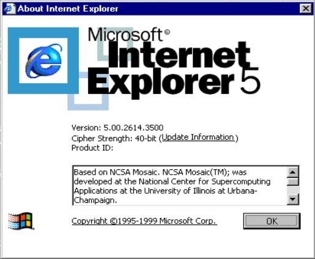
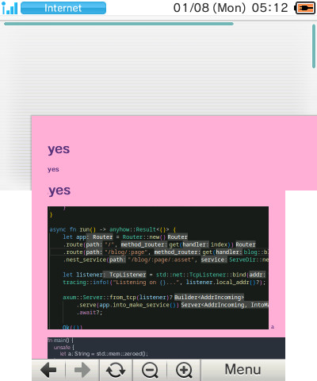
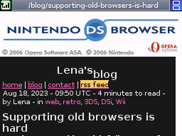
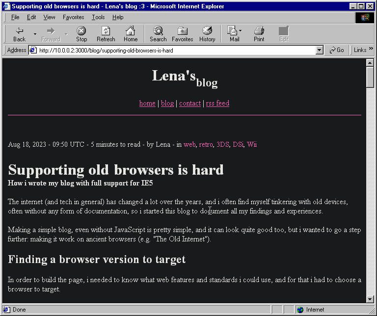
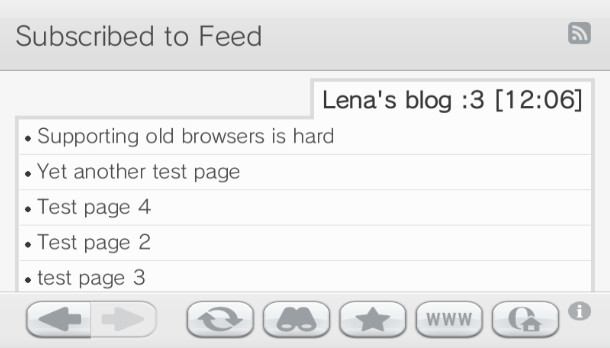

<!--[title|Supporting old browsers is hard]-->
<!--[description|How i wrote my blog with full support for IE5]-->
<!--[author|Lena]-->
<!--[timestamp|1692352218]-->
<!--[tag|web]-->
<!--[tag|retro]-->
<!--[tag|3DS]-->
<!--[tag|DSi]-->
<!--[tag|Wii]-->

The internet (and tech in general) has changed a lot over the years, and i often find myself tinkering with old devices, often without any form of documentation, so i started this blog to document all my findings and experiences.

Making a simple blog, even without JavaScript is pretty simple, and it can look quite good too, but i wanted to go a step further: making it work on ancient browsers (e.g. "The Old Internet").

## Finding a browser version to target

In order to build the page, i needed to know what web features and standards i could use, and for that i had to choose a browser to target.

So i did what anyone would do: I booted *Windows 98 Second Edition* in [86Box](https://86box.net/) to see what works.

I wanted my page to be flawless in a stock installation, so i went to check the Internet Explorer version that is preinstalled, and... it's IE5.



So... this was what i had, and i had to work with it.

This was gonna be hard, as i had never written raw CSS myself, and only through TailwindCSS, and starting on a known-broken CSS implementation wasn't the best idea i've ever had.

As for the dynamic content in the pages, i had to use templating, because the limited JavaScript capabilities of IE5 are quite broken and nonstandard ([it doesn't even support `addEventListener()`](https://caniuse.com/addeventlistener)).

After looking on [crates.io](https://crates.io/categories/template-engine) for a while, i settled on [askama](https://github.com/djc/askama), as i had previously used it on another project and was satisfied with what it offers.

At this point i started writing the skeleton of the page, when i realized that this was not the only old browser i could target.

Since i often tinker with game consoles like my 3DS or Wii, and since they have a browser, why not make my blog be viewable on those platforms as well?

So i grabbed my (Old) 3DS and... the page skeleton rendered exactly as it did on my PC. Perfect!



the page didn't fit the screen, but that was only a matter of adding the proper `<meta>` tag.
```html
<meta name="viewport" content="width=device-width, initial-scale=1">
```

With this, it now rendered properly regardless of screen size.

## The elephant in the room

With a page skeleton, it was time for ***styling***. And the problems started to pile up.

With most *unsupported* things, there was a similiar way to achieve the same goal with older CSS, but the real problems come when you run into browser bugs.

And there were a *LOT* of them.

For starters, IE5 doesn't respect `margin` or `padding` values when `display: inline` is used.

It also doesn't support colors with alpha ***in any capacity***, so i had to use [premultiplied alpha](https://en.wikipedia.org/wiki/Alpha_compositing#Straight_versus_premultiplied). (in fact, if you look at the previous image on IE5, the transparency will be *white*)

It also doesn't support a lot of CSS selectors, including `+`, ***completely ignores*** `max-width`, `max-height` and unsupported HTML tags, like `<header>` or `<footer>`, where even setting `display: block` will not make them act like a `<div>`, and will be entirely ignored instead.

Some other problems were shared by multiple browsers: The line that divides header and footer from the page content was originally implemented with a simple rule:
```css
header {
    border-bottom: 1px solid #ff66ba;
    padding-bottom: 5px;
}
```

But neither IE5, the 3DS, the DSi or Wii browser respected the rule, ignoring the border completely, and i had to use a separate `<div>` element.

To work around the unsupported HTML tags, i had to also surround them with ***yet more*** `<div>` elements.

This didn't help with the original [*Nintendo DS Browser*](https://en.wikipedia.org/wiki/Nintendo_DS_Browser) though, where the header links still aren't centered (see top screen).



Replacing `<header>`, `<nav>` and `<span>` with `<div>` would have fixed the issue, but using [semantic HTML tags and ARIA labels](https://developer.mozilla.org/en-US/docs/Web/Accessibility/ARIA) helps with keyboard navigation, [accessibility and screen readers](https://developer.mozilla.org/en-US/blog/aria-accessibility-html-landmark-roles/), which i'm not willing to compromise on, so i'll not be making that change.

After a lot of fighting browser bugs, i finally have arrived at a design i'm happy with (which is probably the one you're looking at right now)

(This is how the page looks on IE5, for those curious)



## A nice find

When implementing RSS and testing the page on the different browsers, i stumbled upon a nice find: The Wii and DSi browsers have built-in RSS feed readers, with the Wii allowing you to *subscribe* to feeds and receive notifications when there are any updates!

This is not present however in the original [*Nintendo DS Browser*](https://en.wikipedia.org/wiki/Nintendo_DS_Browser) and was not added to the 3DS browser, for some reason, probably because social media made RSS feeds a lot less popular, so much so that Nintendo made [*Miiverse*](https://en.wikipedia.org/wiki/Miiverse) in 2013.

Here's the Wii feed reader:



And here's the DSi one:


I really couldn't find anything online about the DSi RSS feed reader, so it was a really nice find.

Still, i wouldn't recommend using any of these browsers, if not for fun and nostalgia, as they're packed with vulnerabilities (the DSi has [stylehax](https://github.com/nathanfarlow/stylehax) by [nathan](https://github.com/nathanfarlow), the New 3DS has [super-skaterhax](https://github.com/zoogie/super-skaterhax) by [zoogie](https://github.com/zoogie), and these are only the KNOWN ones...)

If you do however boot one of them up, be sure to check how this page looks, and if you have any weird/old browsers to try, [please let me know](https://social.treehouse.systems/@lena).
